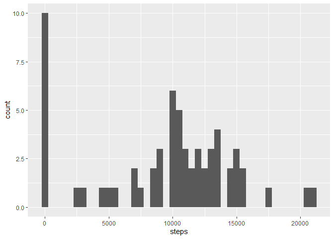
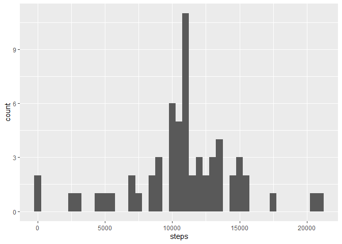
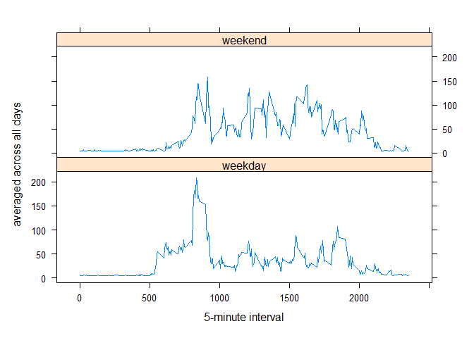

## Loading and preprocessing the data


```r
df <- read.csv("activity.csv", header = TRUE)
df$date <- as.Date(df$date, "%Y-%m-%d")
```

## Import library


```r
library(dplyr)
library(ggplot2)
library(Hmisc)
```

## What is mean total number of steps taken per day?


```r
# Exclude NA
df_2 <- df %>% group_by(date) %>% summarise(steps = sum(steps, na.rm=TRUE))

# Make a histogram of the total number of steps taken each day
ggplot(df_2, aes(x=steps)) + geom_histogram(binwidth = 500)
```

<!-- -->

```r
# Calculate and report the mean and median total number of steps taken per day
mean_steps <- mean(df_2$steps, na.rm=TRUE)
median_steps <- median(df_2$steps, na.rm=TRUE)
```

The mean and median number of steps taken per day is 9354.2295082 and 10395 respectively.

## What is the average daily activity pattern?


```r
df_3 <- tapply(df$steps, df$interval, mean, na.rm = TRUE)

# Time series plot (i.e. type = "l") of the 5-minute interval (x-axis) and the average number of steps taken, averaged across all days (y-axis)
plot(row.names(df_3), df_3, type = "l", xlab = "5-minute interval", 
    ylab = "averaged across all days", col= "blue")
```

<!-- -->

```r
# Which 5-minute interval contains the maximum number of steps
max_interval <- names(which.max(df_3))
```

Which 5-minute interval, on average across all the days in the dataset, contains the maximum number of steps? Ans: 835

## Imputing missing values


```r
#  Number of missing values in the dataset (i.e. the total number of rows with NAs)
num_miss <- sum(is.na(df))

# Create a new dataset that is equal to the original dataset but with the missing data filled in.
df_4 <- df
df_4$steps <- impute(df$steps, fun=mean) # fill in using the mean value of 5-min interval
df_4_day <- df_4 %>% group_by(date) %>% summarise(steps = sum(steps, na.rm=TRUE))

# Make a histogram of the total number of steps taken each day
ggplot(df_4_day, aes(x=steps)) + geom_histogram(binwidth = 500)
```

<!-- -->

```r
# Calculate and report the mean and median total number of steps taken per day
mean_steps_df_4 <- mean(df_4_day$steps)
median_steps_df_4 <- median(df_4_day$steps)
```

Number of missing values in the dataset is 2304.

After imputing the missing values with the mean number of steps in 5-min interval, the mean and median number of steps taken per day is 1.0766189\times 10^{4} and 1.0766189\times 10^{4} respectively, higher than before imputing the missing valyues.

## Are there differences in activity patterns between weekdays and weekends?


```r
# Create a new factor variable in the dataset with two levels -- "weekday" and "weekend" indicating whether a given date is a weekday or weekend day.
df_4$weekdays <-  ifelse(as.POSIXlt(df_4$date)$wday %in% c(0,6), 'weekend', 'weekday')

#df_5 <- tapply(df_4$steps, list(df_4$interval, df_4$weekdays), mean, na.rm = TRUE)
df_4$weekdays <- factor(df_4$weekdays)
df_5 <- aggregate(steps ~ interval + weekdays, df_4, mean)
names(df_5) <- c("interval", "weekdays", "steps")

# Panel plot containing a time series plot (i.e. type = "l") of the 5-minute interval (x-axis) and the average number of steps taken, averaged across all weekday days or weekend days (y-axis). 
xyplot(steps ~ interval | weekdays, df_5, type = "l", layout = c(1, 2), 
    xlab = "5-minute interval", ylab = "averaged across all days")
```

<!-- -->

Average number of steps generally higher during weekends than weekdays.

